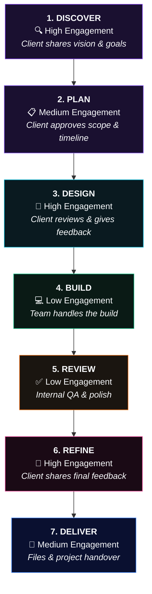
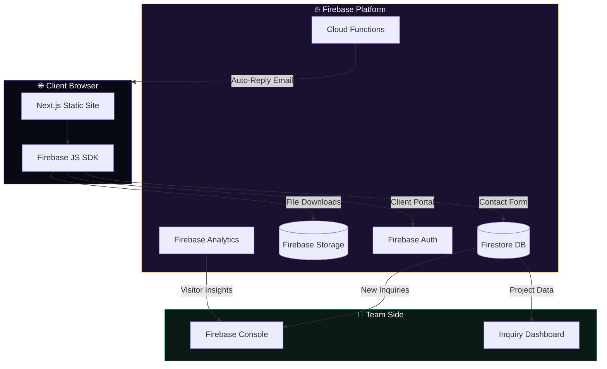
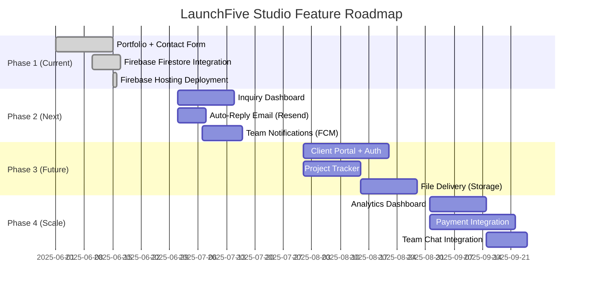

<div align="center">

<!-- 3D Pop-up Hero Banner -->


[](https://launchfive-studio.web.app)
[](https://nextjs.org/)
[](https://www.typescriptlang.org/)
[](https://firebase.google.com/)
[](./LICENSE)

<br/>

<table>
<tr>
<td align="center"><strong>5</strong></td>
<td align="center"><strong>11</strong></td>
<td align="center"><strong>7</strong></td>
<td align="center"><strong>24h</strong></td>
<td align="center"><strong>0</strong></td>
</tr>
<tr>
<td></td>
<td></td>
<td></td>
<td></td>
<td></td>
</tr>
</table>

</div>

---

## About

**LaunchFive Studio** is a focused 5-member creative-tech studio that builds websites, mobile apps, UI/UX designs, brand identities, ad creatives, and digital templates. We work directly with clients — no account managers, no handoffs — just clear communication and modern execution from start to finish.

> **Small team. Sharp focus. Direct collaboration.**

---

## How It Works

### Client Journey

```mermaid
flowchart LR
    A[🔍 Land on Website] --> B[📋 Explore Services]
    B --> C[👥 Meet the Team]
    C --> D[📂 View Portfolio]
    D --> E[🔄 Understand Process]
    E --> F[📝 Submit Inquiry]
    F --> G[⚡ Response in 24h]
    G --> H[🚀 Project Starts]

    style A fill:#070A13,stroke:#7C3AED,color:#F8FAFC
    style B fill:#070A13,stroke:#06B6D4,color:#F8FAFC
    style C fill:#070A13,stroke:#10B981,color:#F8FAFC
    style D fill:#070A13,stroke:#F97316,color:#F8FAFC
    style E fill:#070A13,stroke:#8B5CF6,color:#F8FAFC
    style F fill:#070A13,stroke:#7C3AED,color:#F8FAFC
    style G fill:#070A13,stroke:#10B981,color:#F8FAFC
    style H fill:#7C3AED,stroke:#7C3AED,color:#FFFFFF
```



### 7-Step Project Process



### Firebase Architecture



---

## Team

<table>
<tr>
<td align="center" width="20%">
<br/>
<b>Dipesh Borana</b><br/>
<sub>Full-Stack Developer</sub><br/>
<sub><code>React · Next.js · Node.js</code></sub>
</td>
<td align="center" width="20%">
<br/>
<b>Ronak Jain</b><br/>
<sub>App Developer</sub><br/>
<sub><code>React Native · Flutter · Firebase</code></sub>
</td>
<td align="center" width="20%">
<br/>
<b>Prince Chauhan</b><br/>
<sub>UI/UX Designer</sub><br/>
<sub><code>Figma · Adobe XD · Design Systems</code></sub>
</td>
<td align="center" width="20%">
<br/>
<b>Pooja Kumawat</b><br/>
<sub>Graphic Designer</sub><br/>
<sub><code>Illustrator · Photoshop · Branding</code></sub>
</td>
<td align="center" width="20%">
<br/>
<b>Mehul Kumar</b><br/>
<sub>Ads & Campaign Designer</sub><br/>
<sub><code>After Effects · Ad Design · Copy</code></sub>
</td>
</tr>
</table>

---

## Services

| | Service | Timeline | Best For |
|---|---------|----------|----------|
| 🟣 | **Full-Stack Development** | 2-6 weeks | Startups & complete web platforms |
| 🔵 | **Mobile App Development** | 3-8 weeks | MVPs & mobile-first businesses |
| 🟠 | **Website Design** | 1-3 weeks | Portfolios & small businesses |
| 🟢 | **UI/UX Design** | 1-4 weeks | Product concepts & redesigns |
| 🔴 | **Graphic Design** | 3-7 days | Marketing teams & brand launches |
| 🟣 | **Branding & Logo Design** | 1-2 weeks | New businesses & visual identities |
| 🩷 | **Ad Creatives & Campaign** | 3-7 days | Paid campaigns & promotions |
| 🟢 | **Campaign Strategy & Design** | 1-3 weeks | Product launches & rollouts |
| 🟡 | **Social Media Templates** | 3-5 days | Content teams & influencers |
| 🔵 | **Branding Kits** | 2-3 weeks | First-time brand builders |
| 🔵 | **Landing Page Design** | 1-2 weeks | Lead generation & launches |

---

## Tech Stack

<p align="center">

| Category | Technologies |
|----------|-------------|
| **Framework** |    |
| **Styling** |   |
| **Animation** |   |
| **Interactive UI** | 3D-animated hero + premium "Our Workflow" guided journey (glassmorphism cards, scroll-triggered alternating animations, active-step glow, gradient timeline) |
| **Backend** |   |
| **Validation** |   |
| **Deployment** |  |

</p>

---

## Project Structure

```
launchfive-studio/
├── 📁 public/                  # Static assets
│   ├── logo.svg                # Brand logo
│   ├── .nojekyll               # Firebase hosting fix
│   └── 📁 portfolio/           # Project thumbnails
├── 📁 src/
│   ├── 📁 app/                 # Next.js App Router
│   │   ├── layout.tsx          # Root layout + metadata
│   │   ├── page.tsx            # Home page (all sections)
│   │   ├── globals.css         # Global styles + utilities
│   │   └── 📁 api/contact/     # (Legacy API route)
│   ├── 📁 components/
│   │   ├── 📁 common/          # Navbar, Footer, Logo, CTA, SectionHeading, ThemeToggle
│   │   ├── 📁 home/            # Hero, Services, WhyUs, Team, Portfolio, Process, FAQ, Contact
│   │   └── 📁 3d/              # Hero3DScene, Process3DScene, AnimatedSphere, FloatingIcons
│   ├── 📁 data/                # Static data (services, team, portfolio, whyUs, process)
│   ├── 📁 lib/                 # Firebase config, Prisma client, validations (Zod)
│   ├── 📁 hooks/               # Custom hooks (use-toast, use-mobile)
│   └── 📁 ui/                  # shadcn/ui components
├── .env                        # Firebase env vars (NEXT_PUBLIC_FIREBASE_*)
├── next.config.ts              # Static export for Firebase
├── firebase.json               # Hosting (public: out) + Firestore rules
├── firestore.rules            # Firestore security rules (contacts: create allowed)
├── tailwind.config.ts          # Tailwind CSS configuration
└── package.json                # Dependencies & scripts
```

---

## Getting Started

### Prerequisites

- Node.js 18+ or Bun
- A Firebase project (free at [console.firebase.google.com](https://console.firebase.google.com))

### 1. Clone the Repository

```bash
git clone https://github.com/dev-dipeshkumar/launchfive-studio.git
cd launchfive-studio
```

### 2. Install Dependencies

```bash
npm install
```

### 3. Set Up Firebase

The project ships with a `.env` file containing the Firebase web config. If you need to re-create it, add your Firebase credentials:

```bash
cp .env .env.local   # or just edit .env directly
```

Edit `.env` with your Firebase project values from:
> Firebase Console → ⚙️ Project Settings → General → Your apps → Web app → Config

```env
NEXT_PUBLIC_FIREBASE_API_KEY=your_api_key
NEXT_PUBLIC_FIREBASE_AUTH_DOMAIN=your_project.firebaseapp.com
NEXT_PUBLIC_FIREBASE_PROJECT_ID=your_project_id
NEXT_PUBLIC_FIREBASE_STORAGE_BUCKET=your_project.appspot.com
NEXT_PUBLIC_FIREBASE_MESSAGING_SENDER_ID=your_sender_id
NEXT_PUBLIC_FIREBASE_APP_ID=your_app_id
NEXT_PUBLIC_FIREBASE_MEASUREMENT_ID=your_measurement_id
```

> The contact form (`src/components/home/ContactSection.tsx`) writes submissions directly to Firestore via the Firebase JS SDK (`addDoc`), governed by `firestore.rules` (anonymous `create` allowed on `/contacts`).

### 3b. Analytics, Monitoring & Search-Engine Verification

All configuration is centralized through environment variables and the single
site config file (`src/lib/site.ts`). Copy `.env.example` → `.env` and fill in
only what you need — every value is optional and blank values are skipped.

| Concern | Variable | Where to get the token |
| --- | --- | --- |
| **Canonical URL** | `NEXT_PUBLIC_SITE_URL` | Your production domain (no trailing slash) |
| **Google Analytics 4** | `NEXT_PUBLIC_GA4_ID` | GA4 → Admin → Data Streams → Measurement ID (`G-XXXX`) |
| **Microsoft Clarity** | `NEXT_PUBLIC_CLARITY_ID` | Clarity → Settings → Setup → Project ID |
| **Google Search Console** | `NEXT_PUBLIC_VERIFICATION_GOOGLE` | Search Console → Settings → Ownership verification → HTML tag → `content` value |
| **Bing Webmaster Tools** | `NEXT_PUBLIC_VERIFICATION_BING` | Bing Webmaster → Verify → Meta tag → `content` value |
| **Yandex Webmaster** | `NEXT_PUBLIC_VERIFICATION_YANDEX` | Yandex Webmaster → Site management → Meta tag → `content` value |
| **Pinterest** | `NEXT_PUBLIC_VERIFICATION_PINTEREST` | Pinterest Business → Settings → Claim → HTML tag → `content` value |
| **Facebook Domain** | `NEXT_PUBLIC_VERIFICATION_FACEBOOK` | Business Manager → Brand Safety → Domains → `content` value |

- **Analytics** load only in production and only when an ID is present
  (`src/components/common/Analytics.tsx`). Events tracked: CTA clicks, WhatsApp
  clicks, portfolio clicks, nav clicks, theme toggle, form submission, and
  scroll depth (`src/lib/analytics.ts`).
- **Verification tokens** are emitted as `<meta>` tags in `src/app/layout.tsx`
  via the `verification` metadata field, so they survive every future deploy.
- **AI / LLM discoverability**: `public/llms.txt` (llms.txt convention),
  `public/humans.txt` (team + stack), and `public/rss.xml` (empty, extensible
  feed) are served at the site root and allowed in `public/robots.txt`.
- **SEO essentials** are centralized in `src/lib/site.ts` and `src/app/layout.tsx`:
  canonical URL, Open Graph, Twitter Card, JSON-LD structured data
  (`src/components/common/StructuredData.tsx`), `sitemap.xml`, and `robots.txt`.


### 4. Set Up Firestore

1. Go to Firebase Console → **Build** → **Firestore Database** → **Create database**
2. Choose **Start in test mode**
3. Select location: `asia-south1` (or closest to your region)
4. Click **Create**

### 5. Run Development Server

```bash
npm run dev
```

Visit [http://localhost:9002](http://localhost:9002)

### 6. Build for Production

```bash
npm run build
```

The static output will be in the `/out` directory, ready for Firebase Hosting.

---

## Deployment to Firebase Hosting

```mermaid
flowchart LR
    A[💻 Local Code] -->|git push| B[📦 GitHub]
    B -->|auto-deploy| C[🔥 Firebase]
    C -->|build + deploy| D[🌐 Live Website]

    style A fill:#070A13,stroke:#7C3AED,color:#F8FAFC
    style B fill:#070A13,stroke:#F8FAFC,stroke-dasharray: 5 5
    style C fill:#1a1030,stroke:#FFCA28,color:#F8FAFC
    style D fill:#10B981,stroke:#10B981,color:#FFFFFF
```



### Option A: Browser-Only (No Terminal)

1. Create a GitHub repository and upload this code
2. Go to [Firebase Console](https://console.firebase.google.com) → **Hosting** → **Connect to GitHub**
3. Set build config: Branch=`main`, Build command=`npm run build`, Output directory=`out`
4. Firebase auto-deploys on every push

### Option B: CLI Deployment

```bash
npm i -g firebase-tools
firebase login
firebase init hosting
firebase deploy --only hosting
```

> See the [Firebase Deployment Guide](./Firebase-Deployment-Guide-LaunchFive-Studio.pdf) for complete browser-only steps.

---

## Future Roadmap



| Phase | Feature | Firebase Service | Status |
|-------|---------|-----------------|--------|
| **1** | Portfolio + Contact Form | Firestore | ✅ Done |
| **2** | Inquiry Dashboard | Firestore + Auth | 🔄 Planned |
| **2** | Auto-Reply Email | Cloud Functions + Resend | 🔄 Planned |
| **2** | Team Notifications | Cloud Functions + FCM | 🔄 Planned |
| **3** | Client Portal | Firestore + Auth | 📋 Roadmap |
| **3** | Project Tracker | Firestore | 📋 Roadmap |
| **3** | File Delivery | Firebase Storage | 📋 Roadmap |
| **4** | Analytics Dashboard | Firebase Analytics | 📋 Roadmap |
| **4** | Payment Integration | Stripe / Razorpay | 📋 Roadmap |
| **4** | Team Chat Integration | Cloud Functions | 📋 Roadmap |

---

## Contact

<p align="center">

[](mailto:hello@launchfivestudio.com)
[](https://wa.me/919876543210)
[](https://launchfive-studio.web.app)

</p>

<div align="center">


</div>
